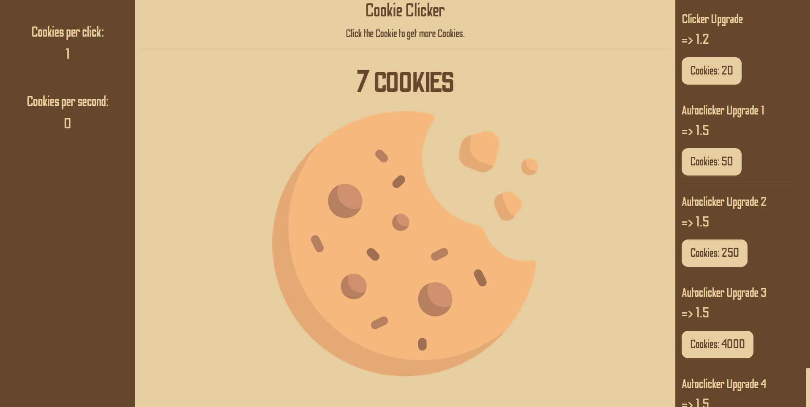

# CookieClicker

## URL
https://jensdenijs.github.io/CookieClicker/

## Preview webpage

## Goal
I tried making my own version of some famous ClickerGames.
The goal of this project is to practice my programming skills in Javascript/HTML/CSS.

## Focus
While working on this project I mainly tried focussing on using Functions() in a proper way and keeping my code as clean as possible.

## What I learned
With the right focus in mind. I must admit that I'm not satisfied with the amount of functions I used and the properness of my code. 
I did feel like I know how to tackle these issues way better next time, and my main focus will be on starting with a well constructed plan before I start coding.

## HTML/CCS
I'm very happy with the end-result and I like the looks I gave to this project.

###ToDo (while working on the project)
- notes in code
- readme repo
- clean code
- more functions
